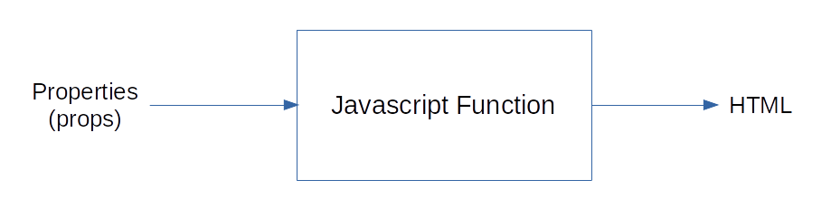
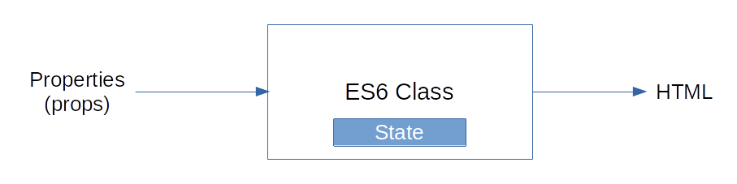

# React

React is a javascript library to build UI.

## Prerequisites

**HTML**, **CSS** and **Javascript** fundamentals

**ES6**
**Javascript** - `this` keyword, `filter`, `map` and `reduce`.

**ES6** - `let` & `const`, `arrow functions`, `template literals`, `default parameters`, `object literals`, `rest and spread operators` and `destructuring` assigment.

## React Fundamentals

## React and HTTP

## Routing with React

## state management with Redux

## Utilities that will work well with React

We need to install [nodejs](https://nodejs.org/)

## Create Reat App

```bash
npx create-react-app <project-name>
cd my-app
npm start
```

## Folder Structure

```diagram
.
├── node_modules (folder)
├── public (folder)
|     ├── favicon.ico
|     ├── index.html
|     └── manifest.json
├── src (folder)
|    ├── App.css
|    ├── App.jsx
|    ├── index.css
|    └── index.js
├── .gitignore
├── package-lock.json
├── package.json
└── README.md
3 directories, 4 files
```

at the root level we ahve 3 directories and 4 files to begin with

- package.json: this file contains `dependencies` and `scripts` that required for the project, `scripts` used to run the application. (based on npm as a package manager you are going to see package-lock.json)
- package-lock.json: contains your installtion of dependencies (you don't worry about them)
- node_modules: in this folder are all the dependencies are installed, it is generated when you run `create-react-app command` or `npm install`.
- public: contain `icon`, `manifest.json` and `index.html` is the only html file we have in our application, because we are building a single page application.
- src: the starting point for react application is `index.js` in this file we specify the root component (App component) and the DOM element which is controlled by react `(with id="root")` this element is in index.html file, and `App.jsx` represents the view which we see in the browser.

## Components

Components describe a part of the UI.

They are `re-usable` and can be nested inside other components

There are two types of Components

- Stateless Functional Componenets
- Stateful Class Components

Components are the building blocks of any React application

### Functional Components

`Functional Components` are just Javascript functions and they optionaly receive an object of properties which is referred to as `props` and return HTML which describes the UI.



`Example:` We have a Greet.jsx in components folder file as follow:

```react
import React from 'react'

const Greet = () => <h1>Hello World!</h1>;

export default Greet
```

we musst import this file in App.jsx as follow:

```react
import React, { Component } from 'react';
import logo from "./logo.svg";
import './App.css';
import Greet from './components/Greet.jsx';

class App extends Component {
    render() {
        return (
            <div className="App">
                <Greet />
            </div>
        )
    }
}

export default App;
```

#### Note

- `import {Component} from ...` that means the Component is not exported as a default.

### Class Components

`Class Componenets` are simillar to Functional Components and also can optionaly recieve a props as input and return HTML.

a Class Component can also maintain a privat internal state `(some information)` which is privat to that component and use this information to describe the UI.



`Example:` We have a Welcome.jsx in components folder file as follow:

```react
import React, { Component } from 'react'

class Welcome extends Component{
    render(){
        return <h1>Class Component</h1>;
    }
}

export default Welcome
```

we musst import this file in App.jsx as follow:

```react
import React, { Component } from 'react';
import logo from "./logo.svg";
import './App.css';
import Greet from './components/Greet.jsx';
import Welcome from './components/Welcome.jsx';

class App extends Component {
    render() {
        return (
            <div className="App">
                <Greet />
                <Welcome />
            </div>
        )
    }
}

export default App;
```

| Functional Component                         | Class Component                    |
| -------------------------------------------- | ---------------------------------- |
| Simple functions                             | More feature rich                  |
| Use Functional Component as much as possible | Maintain their own private `state` |
| Absence of `this` keyword                    | Complex UI logic                   |
| Solution without using state                 | Provide lifecycle hooks            |
| Mainly responsible for the UI                |                                    |

#### [Note about React Hooks](https://reactjs.org/docs/hooks-state.html 'to open in a new Tab ctrl+ mouse click')

- `Hooks` let you use `state` and other React features without writing a class.

## JSX

- JavaScript XML (JSX) - Extention to javascript language syntax.
- Write XML - like code for element and components
- JSX tags have a tag name, attributes and childern.
- JSX is not a necessity to write React application.
- JSX makes your react code simpler and elegant.
- JSX ultimately transpiles to pure JavaScript which is understood by the browsers.

`JSX code`

```jsx
const Hello = () => {
  return (
    <div>
      <h1> Hello kenan </h1>
    </div>
  );
};
```

`the same code but in js`

```js
React.createElement(
  'div',
  { id: 'id_name', className: 'class_name' },
  React.createElement('h1', null, 'some text')
);
```

- the Method `React.createElement()` take 3 parameters and can accept any number of elements as childern.
  - `string` HTML tag to be rendered ("div")
  - optional properties as an object that will apply to the element (`{id:"some id", className:"some class"}` or `null`)
  - the childern of the HTML element

## Props

We specify props for a component as an attribute and make the component dynamic.

```react
<Greet name="Bruce" heroName="Batman">
    <p>This is children props</p>
</Greet>
<Greet name="Clark" heroName="superman">
    <button>Action</button>
</Greet>
<Greet name="Diana" heroName="Wonder Woman" />
```

here we are sending some information or some `property` from App component to the Greet component and in the Greet component

- add a parameter to the functional component called `props` (for example)
- `props` is an object that contains the sttributes and the values which has been passed from the parent component

```react
const Greet = props =>{
    return (
        <div>
            <h1>Hello {props.name} a.k.a {props.heroName} </h1>;
            {props.children}
        </div>
    )
}

export default Greet
```

- using `this` keyword which is reserved in class component

```react
<Welcome name="Bruce" heroName="Batman" />
<Welcome name="Clark" heroName="superman" />
<Welcome name="Diana" heroName="Wonder Woman" />
```

```react
class Welcome extends Component{
    render(){
        return <h1>Welcome {this.props.name} a.k.a {this.props.heroName}</h1>;
    }
}
```

- `props` are immutable (the value can not be changed by assigning a new value)

## State

`Example:` Create a class component called Message.jsx

```react
import React, { Component } from 'react'

class Message extends Component{
    render(){
        return <h1>Welcome Visitor</h1>;
    }
}

export default Message
```

in App.jsx

```react
import Message from './components/Message.jsx';

class App extends Component {
    render() {
        return (
            <div className="App">
                <Message />
            </div>
        )
    }
}

```

`requierment`
We need to have a subscribe button below the text `Welcome Visitor` and when we click on the button the text should changed from `Welcome Visitor` to `Thank you for Subscribing`
The Message will be send from App.jsx as a property, it will be not work as props are immutable, once the Message is send to Welcome visitor it can be never changed from the message component, the solution is to use component state

- add a state in Message.jsx
- bind this state value in the render
- add a button element
- add onclick event to the button to change the message

```react
class Message extends Component{
    state={
        meassage:"Welcome Visitor"
    }
    changeMessage(){
        this.setState({
            message:"Thank you for Subscribing"
        })
    }
    render(){
        return(
            <div>
                <h1>{this.state.message}</h1>;
                <button onClick={()=>this.changeMessage()}>Subscribe</button>
            </div>
        )
    }
}
```

| props                             | state                                   |
| --------------------------------- | --------------------------------------- |
| props get passed to the component | state is managed within the component   |
| Function parameters               | Variables declared in the function body |
| props are immutable               | state can be changed                    |
| props - Functional components     | useState Hook - Functional Components   |
| this.props - Class Components     | this.state - Class Components           |

## setState

- create a class component named Counter.jsx

```react
import React, { Component } from 'react'

class Counter extends Component{
    render(){
        return (
            <div>count</div>
        )
    }
}

export default Counter
```

- in App.jsx you should import Counter component and add to the return Counter component

```react
import Counter from './components/Counter.jsx';

class App extends Component {
    render() {
        return (
            <div className="App">
                <Counter />
            </div>
        )
    }
}
```

`in counter.jsx`

- add a state has a property `count : 0`
- use it in the render
- add a button to increment the count value
- add event to the button
- define the increment method that increase the count by 1 using `setState`

```react
class Counter extends Component{
    state={
    count: 0
    }
    increment(){
        this.setState({
            count: this.state.count + 1
        })
    }
    render(){
        return (
            <>
            <div>Count - {this.state.count}</div>
            <button onClick={()=>this.increment()}>Increment</button>
            </>
        )
    }
}

```

`setState` method has 2 parameters the first parameter is the `state object` and the second parameter is the `callback function`.

```react
increment(){
        this.setState({
            count: this.state.count + 1
        },
        ()=>{
            console.log("Callback value", this.state.count)
        })
    }
```

`When you need to execute some code after the state has been changed place that code in the callback function which passed as a second parameter to the setState method.`

Now if we want to create another mothod called incrementFive as follow

```react
incrementFive(){
    this.increment()
    this.increment()
    this.increment()
    this.increment()
    this.increment()
}
```

and in onClick event we want to call incrementFive function and we expected that the count should be changed from 0 to 5 when we click on the button and when we clicked on the button the value changed to 1 instead of 5 and the callback function called 5 times and return the value 1 and the updated value doesn't carry over between the different calls

in this case we want to update the state based on the previous state and we need to pass a function as an argument to setState method instead of passing it an object

```react
increment(){
        this.setState(prevState =>({
            count: prevState.count + 1
        }))
    }
```

and the second parameter to setState is the props object

```react
this.setState((prevState, props)=>({
    count: prevState.count + props.addValue
}))
```

### notes about setState

- Always make use of setState and never modify the state directly.
- Code has to be executed after the state has been updated? Place that code in the callback function which is the second argument to the setState method.
- When you have to update state based on the previous state value, pass in a function as an argument instead of the regular object.

## Destructuring props and state

### Examples

`Destructuring props in Functional components`

```react
const Greet = ({name, heroName, children}) =>{
    return (
        <div>
            <h1>Hello {name} a.k.a {heroName} </h1>;
            {children}
        </div>
    )
}
```

`or in the body`

```react
const Greet = props =>{
    const {name, heroName, children} = props
    return (
        <div>
            <h1>Hello {name} a.k.a {heroName} </h1>;
            {children}
        </div>
    )
}
```

`Destructuring in calss components`

```react
class Welcome extends Component{
    render(){
        const {name, heroName} = this.props
        return <h1>Welcome {name} a.k.a {heroName}</h1>;
    }
}
```

`if we havea number of state properties the syntax is`

```react
const {state1, state2} = this.state
```

## Event Handling

### Functional Component

`Example` Create functionClick.jsx in component folder as a functional component

```react
import React from 'react'

function FunctionClick(){
    functon clickHandler(){
        console.log("Button clicked!")
    }
    return (
        <>
        <button onClick={clickHandler}>Click</button>;
        </>
    )
}

export default FunctionClick
```

in App.jsx

```react
<FunctionClick />
```

### Class Component

`Example` Create classClick.js in component folder as a class component

```react
import React from 'react'

class ClassClick extends Component {
    functon clickHandler(){
        console.log("Button clicked!")
    }
    render() {
        return (
            <>
                <button onClick={this.clickHandler}>Click Me!</button>
            </>
        )
    }
}
```

in App.jsx

```react
<ClassClick />
```

## Binding Event Handler
