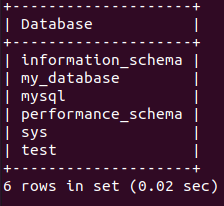
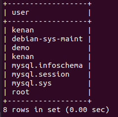

# mysql

## Show databases

To list all databases in the local MySQL database server, first login to the database server as follows:

```mysql
>mysql -u root -p
Enter password: **********
mysql>
```

And then use the `SHOW DATABASES` command:

```mysql
SHOW DATABASES;
```

The following shows the output of the query above:



## List all users in MySQL database server

```mysql
SELECT user FROM mysql.user;
```

To execute this query, you must log in to the MySQL database server as an administrator.

```mysql
>mysql -u root -p
Enter password: **********
mysql> use mysql;
Database changed
mysql> SELECT user FROM user;
```

The following shows the output of the query above:



## Basic mysql

The `SELECT` statement allows you to read data from one or more tables.

```sql
SELECT select_list
FROM table_name
WHERE search_condition
ORDER BY col1 [ASC|DESC], col2 [ASC|DESC], ...
```

| sql keyword                | meaning                                                                                |
| -------------------------- | -------------------------------------------------------------------------------------- |
| SELECT `select_list`       | list of columns that you want to show in the result or \* to select all columns        |
| FROM `table_name`          | the name of the table                                                                  |
| ORDER BY `col1` [ASC DESC] | default value ASC                                                                      |
| WHERE `search_condition`   | combination of one or more predicates using the logical operator `AND`, `OR` and `NOT` |

- You can assign an expression in the `SELECT` clause a `column alias` and use it in the `ORDER BY` clause as shown in the following query:

```sql
SELECT
    orderNumber,
    orderLineNumber,
    quantityOrdered * priceEach AS subtotal
FROM
    orderdetails
ORDER BY subtotal DESC;
```

- Suppose that you want to sort a column based on their statuses in a specific order:

```sql
ORDER BY
    FIELD (status, "status1", "status2", ....)
```

- You can use the `IS NULL` operator To check if a value is NULL or not and returns `TRUE` if it is NULL.
- The following table shows the comparison operators that you can use to form the expression in the `WHERE` clause.

| Operator | Description                                                           |
| -------- | --------------------------------------------------------------------- |
| =        | Equal to. You can use it with almost any data types                   |
| <> or != | Not equal to                                                          |
| <        | Less than. You typically use it with numeric and date/time data types |
| >        | Greater than                                                          |
| <=       | Less than or equal to                                                 |
| =        | Greater than or equal to                                              |
